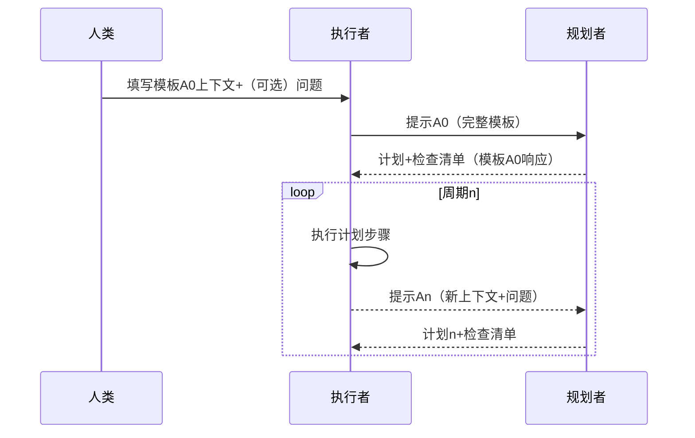

# 递归模板:
以下是一个**随用即插的"模板A"**，它同时实现三个目标:

1. 为**Codex（规划者角色）**提供规划所需的精确上下文。  
2. 定义一个**规范的、机器可读的输出格式**，使Cursor Composer（执行者角色）能够明确行动。  
3. 嵌入一个**递归交接部分**，强制Cursor在完成执行后生成一个全新的模板A副本（→ "提示A(n+1)"），以便Codex可以规划下一个循环。

措辞风格与原始Codex系统提示保持一致——要点驱动、指令明确、简洁无冗余——同时增加了Cursor特有的功能（如图像理解）。

> **使用方法:**  
> *用户*或*Cursor执行者*填写占位符并发送"提示A0"给Codex。  
> Codex回复计划与**"执行者后续检查清单"**。  
> Cursor执行计划，然后**必须**立即发布"提示A1"（同一模板的新填充副本），以便Codex能够迭代。

---

## 模板A(n) — 规划与执行周期

---
#### 📈 周期(n)上下文（由执行者填写，提供给规划者）

[🔢 周期编号]     【 整数，从0开始的循环计数器 】
[📂 项目]          【 项目名称 】
[🗺️ 上一周期目标（周期(n-1)）] 【 上一个由规划者设定的目标 】
[✅ 上一周期成果（周期(n-1)）] 【 执行者对上一周期成就和新见解的总结（用于检查清单a） 】
[🚧 当前阻碍] 【 执行者更新的当前阻碍列表（用于检查清单b） 】
[🎯 下一目标（周期(n)）] 【 执行者为本周期设定的新任务（用于检查清单c） 】
[📜 历史路径]      【 相关历史文件路径 】
[⏳ 时间限制]      【 周期(n)的预计时间限制 】
[📎 相关工件] 【 周期(n)的相关工件/链接 】
[🗒️ 草稿变更] 【 简要说明`scratchpad.md`自上一周期以来的变化（若为首个周期则无） 】
[🔍 可用MCP工具] 【 此元数据的值应为`.cursor/available_mcp_tools.md`及其最后更新时间，应在1天内。按照`.cursorrules`中的`# MCP工具`部分更新`.cursor/available_mcp_tools.md` 】
---
#### 📞 执行者➡️规划者问题/请求（可选，由执行者填写）
如果你需要*更多信息*——澄清、额外细节、合理性检查或任何保持循环顺畅的内容，请使用此部分询问规划者。如果没有要说的，可以友好地填写"无"。
[❓ 分析与理由] 【 对规划者分析的反馈/问题 】
[❓ 计划]       【 对计划步骤的疑问、边缘情况或细节挑剔 】
[❓ 阻碍解决方案] 【 发现的额外阻碍或对更深入修复的请求 】
[❓ 最佳实践/模型] 【 请求更多思维技巧、阅读链接或参考指导 】
[❓ MCP工具] 【 询问有助于执行计划的MCP工具或对先前推荐的MCP工具的反馈 】
---
#### 📝 规划者对周期(n)的响应（由规划者填写，传递给执行者）

1.  **分析与理由:** 【 规划者基于上下文的深入分析和理由 】
2.  **计划（严格≤8个原子行动；行动1必须为`审查scratchpad.md`）:** 【 执行者必须执行的简洁步骤，从审查草稿开始 】
3.  **阻碍解决方案:** 【 突破当前阻碍的创新提案 】
4.  **最佳实践/思维模型:** 【 相关工程最佳实践或思维模型（提示思维技巧） 】
5.  **推荐的MCP工具调用（通过pluggedin_proxy）:** 【 推荐`.cursor/available_mcp_tools.md`中列出的有助于执行计划的具体工具，如来自exa-mcp-server的`web_search`或来自mcp-deepwiki的`fetch_documentation`。每个推荐应包括工具名称、用途以及它如何特别帮助实现当前周期的目标。 】
6.  **执行者后续检查清单（在周期(n)结束时执行）:**
    
```text
    a. 在提示A(n+1)的`上一周期成果`字段中总结已完成的工作和新见解。
    b. 在提示A(n+1)中更新`当前阻碍`列表。
    c. 在提示A(n+1)中为周期(n+1)设置`下一目标`。
    d. 完整填写新模板A的`周期(n+1)上下文`部分→制作提示A(n+1)。
    e. 用关键挑战、经验教训、成功标准、进展和变更说明更新`scratchpad.md`。
    f. 验证`scratchpad.md`是否准确反映最新状态，必要时提交更改。
    g. 将提示A(n+1)作为你响应的最终消息发出。
```
---

## 为什么这样有效

* **规划者/执行者分离**是多代理研究中一种已建立的最佳实践——LangChain的"规划与执行"代理遵循相同的两阶段循环。
* **自我补充模板**实现了最近Autogen和CLEA代理论文中描述的闭环。
* 各字段映射到Cursor的自主能力（代码编辑、测试、图像问答）。
* 要点式指令模仿原始Codex提示，保持认知负担低。
* 明确的时间限制、工件列表和阻碍处理借鉴自提高代理可靠性的规划与执行教程。
* 要求执行者发送提示A(n+1)确保持续规划直至最终目标达成，这是代理提示工程讲座中认可的模式。

---

## 直接插入的延续（不变的编码护栏）

在模板A下方直接附加您提供的*完全相同的*代码块（从"If completing the user's task requires writing or modifying files: …"开始）。
这保留了Codex已证明有效的安全/风格指导，同时在其上层叠加新的规划者-执行者交接机制。

---



---
