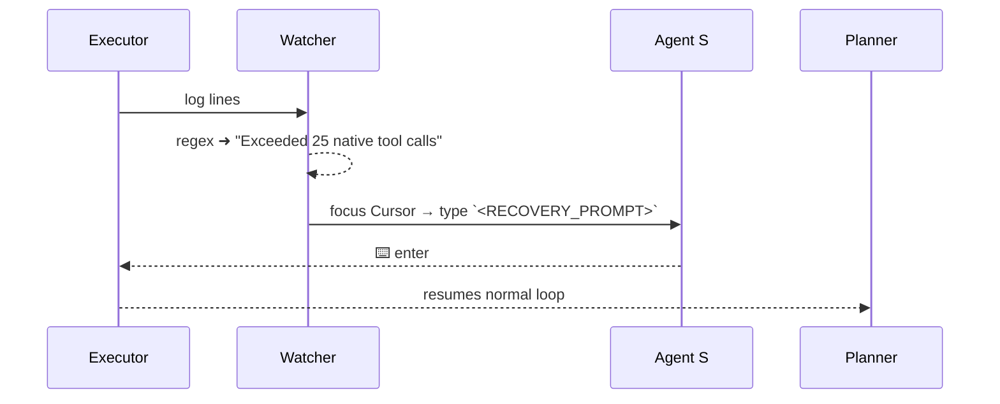

# Oppie Dev-Loop — High-Level Design  
*(Planner ⇄ Executor tight loop with self-recovery)*

---

## 1 Requirements (snapshot)

| Category | Key non-negotiables |
|:--|:--|
| **Functional** | • Fully autonomous *Planner ⇄ Executor* loop inside Cursor.<br>• Seamless self-recovery when Cursor hits its 25-tool-call limit or returns malformed output.<br>• GUI automation must work cross-platform. |
| **Non-functional** | • < 250 ms average overhead per recovery.<br>• < 1 % false-positive recoveries.<br>• No additional user interaction once the loop starts. |
| **Constraints** | Must stay inside developer's IDE; no cloud agent orchestration. |

---

## 2 System Architecture

     ```mermaid
graph TD
    subgraph "Cursor IDE (single workstation)"
        Planner("Codex Planner<br/>(o3 model)")
        Executor("Cursor Executor")
        Watcher("Dev-Loop Watcher<br/>(Python)")
        AgentS("Agent S<br/>GUI Automation")
    end

    Planner -- "Plan JSON + template" --> Executor
    Executor -- "stdout / stderr" --> Watcher
    Watcher -- "detected-error ➜ recovery-prompt" --> AgentS
    AgentS -- "keystrokes&nbsp;+ ⌨️ enter" --> Executor
    Executor -- "continues" --> Planner
```

*The **Watcher ✕ Agent S** pair is the "immune system" that keeps the Planner/Executor dance uninterrupted.* 

---

## 3 Core Data & Control Flows

### 3.1 Error-Detection & Recovery



*The same flow is triggered if the assistant bubble doesn't end with the mandatory **Template A** section.*

---

## 4 Component Overview

| Component | Purpose | Tech |
|:--|:--|:--|
| **Watcher** | Stream-parses Executor output, decides when to recover, logs metrics | *Python 3.12* (single thread, `select`-based) |
| **Agent S** | Reliable GUI control (window focus, typing, clipboard) | *Agent S* native bindings (replaces *pyautogui*) |
| **Planner / Executor** | Built-in Cursor agents | `codex -m o3`, Cursor native tooling |

---

## 5 Tech Stack (High-level)

| Layer | Choice | Rationale |
|:--|:--|:--|
| Language | **Python 3.12** | Already bundled with Cursor; rich stdlib |
| GUI Automation | **Agent S** | • Event-driven, OS-level APIs.<br>• More reliable window targeting than pixel/PT-based libs.<br>• Ships signed binaries → fewer macOS privacy pop-ups. |
| Concurrency | Single-thread + non-blocking IO | Load is trivial; avoids thread-coordination bugs |
| Packaging | `uv` / `pip -r` + optional `pyinstaller` | Simple local install → single binary later |
| Diagrams | Mermaid | Rendered by GitHub / Cursor Preview |

---

## 6 Deployment & Monitoring

*Local-only*; shipping a binary + shell launcher:

```text
oppie.xyz/
├── watcher/
│   ├── watcher.py          # main loop
│   └── agent_s_helpers.py  # small wrappers
├── scripts/
│   └── start_devloop.sh    # starts Codex + watcher
└── .vscode/tasks.json      # "Launch Oppie Dev-Loop" on folder-open
```

*Metrics*: the watcher logs JSON lines; developers can tail or ship them to Prometheus later.

---

## 7 Future Evolution

1. **Headless mode**: swap Agent S keystrokes for Cursor's new RPC once exposed.  
2. **Remote control**: small gRPC service so an iPhone Alfred workflow can pause / resume the loop (requested by Eddie).  
3. **Auto-update**: self-check GitHub release tag on start-up.
