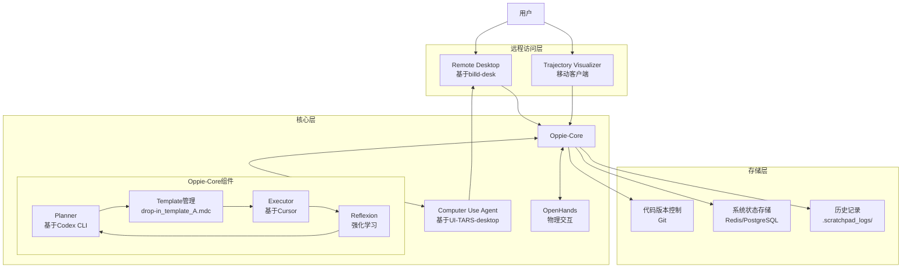

#  High-Level Design  

## 1 Executive Summary & MVP Goal

**Oppie.xyz**是一个自主代码开发助手系统，其灵感来自NASA的火星车Opportunity。该系统旨在创建一个能够在用户离开键盘后继续执行开发任务的AI代理，采用"规划→执行→反思→自愈"的循环工作模式，结合多个先进技术组件。

**MVP Goal**：

- 实现自主Plan-Execute-Reflect循环引擎（Oppie-Core）
- 提供远程访问和控制能力
- 支持实时监控和用户接管
- 实现循环中断恢复和checkpoint回滚
- 将AI代码开发能力与物理交互能力结合

## 2 Requirements (snapshot)

| 类别 | 必要功能（M1阶段） |
|:-------------|:--------------------------|
| **功能性需求** | 1. 自主执行代码开发任务 2. 远程访问和控制 3. 实时监控和用户接管 4. 循环中断恢复 5. Checkpoint回滚 |
| **非功能性需求** | 1. 可靠性：系统应能够从故障中恢复 2. 可扩展性：能够处理不断增加的用户和任务 3. 安全性：保护用户数据和系统访问 4. 性能：低延迟响应和高效执行 |
| **约束条件** | 1. 依赖现有组件（Cursor、Codex CLI等） 2. 需要集成多个独立系统 3. 需要支持多平台访问 |

---

## 3. 系统架构（M1阶段）

**M1阶段架构概述**：

Oppie.xyz系统采用分层架构，包括远程访问层、核心层和存储层。核心层的Oppie-Core组件实现Plan-Execute-Reflect循环，与Computer Use Agent和OpenHands集成，提供GUI自动化和物理交互能力。远程访问层通过Remote Desktop和Trajectory Visualizer提供用户界面，允许用户远程监控和控制系统。存储层保存代码版本、系统状态和历史记录。

这个架构设计实现了高度解耦，每个组件都有明确的职责，通过定义良好的接口进行通信，便于独立开发、扩展和故障隔离。系统支持异步操作，对任务执行和监控至关重要。状态管理通过专用存储实现，确保系统状态的可靠跟踪和更新，支持故障恢复和checkpoint回滚。

---

## 4. 组件目录（M1阶段）

| # | 组件 | 职责 | 关键技术 | PRD需求（M1） |
|:-:|------|------|---------|------------|
| 1 | **Planner** | 分析当前状态、生成计划和解决方案 | Codex CLI, OpenAI API | 自主执行 |
| 2 | **Executor** | 执行Planner生成的计划，实施代码更改和命令 | Cursor IDE | 自主执行 |
| 3 | **Reflexion** | 提供语言代理的强化学习能力，使系统能够从过去的执行中学习 | NeurIPS 2023论文技术 | 自主执行 |
| 4 | **Template管理** | 使用标准格式促进Planner和Executor之间的交流 | drop-in_template_A.mdc | 自主执行 |
| 5 | **Remote Desktop** | 提供远程访问能力，允许用户从任何位置连接到系统 | billd-desk | 远程访问 |
| 6 | **Computer Use Agent** | 提供GUI自动化和交互能力 | UI-TARS-desktop | 循环中断恢复 |
| 7 | **OpenHands** | 提供物理交互能力，扩展系统的自主能力 | OpenHands API | 物理交互 |
| 8 | **Trajectory Visualizer** | 提供系统状态和行为可视化，允许用户评估AI是否脱轨 | 移动应用技术 | 实时监控 |
| 9 | **状态管理** | 跟踪和管理系统状态，支持checkpoint和恢复 | Redis/PostgreSQL | Checkpoint回滚 |

---

## 5. 核心数据和控制流（M1阶段）

**主要数据流**：

1. **任务提交流**：
   - 用户通过Remote Desktop或移动客户端提交任务
   - 任务信息传递给Oppie-Core
   - Planner分析任务，生成计划
   - 计划通过Template A格式传递给Executor

2. **执行与反馈流**：
   - Executor执行计划，实施代码更改和命令
   - 执行结果传递给Reflexion组件
   - Reflexion评估结果，提供反馈
   - 反馈传递给Planner，用于下一个循环

3. **监控与控制流**：
   - Trajectory Visualizer从Oppie-Core获取状态和行为数据
   - 用户通过Trajectory Visualizer监控系统
   - 如检测到异常，发送通知给用户
   - 用户通过Remote Desktop接管系统（如需要）

4. **异常恢复流**：
   - 当Plan-Execute循环中断时，Computer Use Agent检测到中断
   - Computer Use Agent提供GUI界面让用户或AI继续循环
   - 如需回滚，系统从状态存储中恢复到选定的checkpoint
   - 重新启动Plan-Execute循环

**关键数据结构**：

1. **Template A格式**：
   - 定义Planner和Executor之间的通信格式
   - 包含计划、分析、解决方案等字段
   - 存储在.scratchpad_logs/目录中

2. **系统状态模型**：
   - 包含代码仓库状态、执行环境状态、任务状态等
   - 支持序列化和反序列化，用于checkpoint和恢复
   - 使用事务性存储，确保状态一致性

3. **任务生命周期状态机**：
   - 明确定义任务的各个状态（如待处理、初始化、运行中、等待工具输入、恢复中、失败、完成等）
   - 定义状态之间的转换条件和规则
   - 用于追踪和管理任务执行过程

---

## 6. 技术栈（M1阶段摘要）

| 层 | 选择 | 理由 |
|-------------------|---------------------------|-------------------------------------------------------------------------------|
| **后端** | Python, JavaScript, Rust | Python/JavaScript适用于快速开发和API集成，Rust适用于性能关键部分 |
| **框架** | Codex CLI, Cursor IDE, billd-desk, UI-TARS-desktop, Reflexion | 这些是系统核心组件的基础技术，已经验证可行 |
| **通信** | REST API, WebSocket, 消息队列 | REST API适用于基本操作，WebSocket适用于实时通信，消息队列适用于异步操作 |
| **数据存储** | Git, Redis/PostgreSQL | Git管理代码版本，Redis/PostgreSQL存储系统状态和历史 |
| **前端（Web）** | React/Vue.js | 成熟的Web前端框架，适合构建交互式界面 |
| **前端（移动）** | React Native/Flutter | 跨平台移动应用框架，减少开发成本 |
| **容器化** | Docker/Kubernetes | 确保开发和部署环境一致性，便于扩展 |

---

## 7. 部署和VS Code任务

**本地部署**：
- 高性能服务器，配备足够的CPU/GPU、内存和存储
- 低延迟、高带宽网络连接
- 安全要求：防火墙、入侵检测、访问控制

**云部署（选项）**：
- 基于AWS/GCP/Azure
- 使用容器编排（Kubernetes）
- 自动扩展和负载均衡
- 地理分布和高可用性

**VS Code任务配置**：
- 开发环境设置
- 构建和测试命令
- 本地容器管理

---

## 8. 与agentic-coding-steps.mdc和codex.md的对齐（M1阶段）

本设计遵循agentic-coding-steps.mdc中定义的代理编码步骤：
1. **需求**：明确定义了功能和非功能需求
2. **架构设计**：提供了高级系统架构和组件交互
3. **API设计**：定义了组件间的接口和通信方式
4. **数据模型**：描述了关键数据结构和存储策略
5. **技术栈**：选择了适当的技术和框架
6. **实用工具**：规划了支持开发和部署的工具
7. **实现**：为M1阶段的实现提供了清晰路径
8. **优化**：考虑了性能和可扩展性需求
9. **质量保证**：包括错误处理和恢复机制

---

## 9. 未来演进（M1后）

1. **高级AI能力**：
   - 增强Reflexion组件，提高自主学习能力
   - 集成更多AI模型，提供更强大的代码生成和分析

2. **扩展集成**：
   - 集成更多开发工具和平台
   - 支持更多编程语言和框架

3. **多用户支持**：
   - 添加团队协作功能
   - 实现权限和角色管理

4. **高级监控**：
   - 增强可视化和分析功能
   - 提供预测性维护和异常检测

5. **扩展部署选项**：
   - 支持更多云平台和部署模式
   - 提供边缘计算选项

---

## 10. 需求追踪矩阵（M1阶段）

| PRD需求ID（M1） | 描述 | M1关键组件 | HLD章节 |
|:----------------|:----------------------------------------------------------------------------|:-----------------------------------------------------------|:---------------|
| F1 | 自主执行代码开发任务 | Planner, Executor, Reflexion, Template管理 | 4.1-4.4 |
| F2 | 远程访问和控制 | Remote Desktop | 4.5 |
| F3 | 实时监控和用户接管 | Trajectory Visualizer | 4.8 |
| F4 | 循环中断恢复 | Computer Use Agent | 4.6 |
| F5 | Checkpoint回滚 | 状态管理 | 4.9 |
| NF1 | 可靠性 | 所有组件 | 3, 5 |
| NF2 | 可扩展性 | 系统架构 | 3, 6 |
| NF3 | 安全性 | Remote Desktop, 状态管理 | 6, 7 |
| NF4 | 性能 | 技术栈选择 | 6 |
