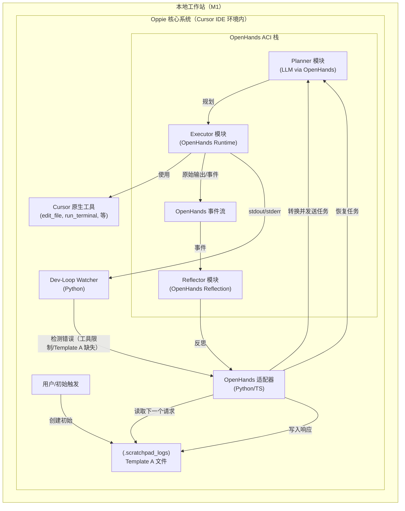

# Oppie 远程光标控制网格（M1）——高层设计
*（Planner ⇄ Executor 紧密循环，移动端触发，具备自恢复能力——市场品牌 **SoraSpark**，内部代号 **oppie.xyz**）*

---

## 1 执行摘要与MVP目标

**M1** 里程碑专注于建立一个以 **OpenHands Agent Communication Interface (ACI)** 为核心、通过 **Template A** 驱动的 Plan-Execute-Reflect 自主编码循环。关键目标包括实现 OpenHands 与现有 Template A 流程的无缝集成（通过 **OpenHands Adapter**），以及由 **Dev-Loop Watcher** 赋能的、针对工具调用限制和 Template A 缺失场景的强大自我恢复机制。同时，M1 将完成对 VDI 资源隔离、GUI 流优化、偏轨检测、移动体验优化和人类接管协议的初步设计和模拟验证。

- **M1 主要目标**：用户通过提供初始 `Template A` 启动编码或研究任务。Oppie（由 OpenHands 驱动）负责执行任务，Dev-Loop Watcher 保障在常见中断（如工具调用次数限制、Planner 响应缺失 Template A）下的自恢复，使循环能自主推进。关键的 VDI 相关概念将被设计和模拟。
- **M1 成功标准**：Plan-Execute-Reflect 循环可通过 OpenHands 稳定运行。针对工具调用限制和 Template A 缺失的恢复机制延迟低于 150ms。Template A 能被正确转换为 OpenHands 任务，OpenHands 事件可被适配器还原为 Template A。VDI 资源隔离、GUI 流、偏轨检测、移动体验和人类接管协议的设计文档齐全并通过模拟验证。无人值守任务成功率 ≥ 40%（SWE-Bench-Lite）。

---

## 2 需求快照

| 类别           | 必须实现（M1 重点）                                                                                   |
|:---------------|:------------------------------------------------------------------------------------------------------|
| **功能性**     | • 由 Template A 驱动的自主 Plan-Execute-Reflect 循环，经 OpenHands ACI 执行。<br>• 支持 Template A ↔ OpenHands 任务/事件的双向适配器。<br>• Dev-Loop Watcher 检测工具调用限制和 Planner 响应缺失 Template A。<br>• 针对上述问题的强大自恢复机制，由 OpenHands Adapter 协调。<br>• 设计并模拟：VDI 资源隔离、GUI 流优化、GUI 偏轨检测。<br>• 设计：移动 PWA 体验、人类接管协议。|
| **非功能性**   | • **P95 恢复延迟 < 150 ms**（针对工具限制和 Template A 缺失）。<br>• 无人值守成功率 ≥ 40%。<br>• 假阳性恢复率 < 1%。<br>• 所有 Template A 循环和重要 OpenHands 事件均需日志记录。|
| **约束条件**   | • 所有核心逻辑在开发者本地工作站运行。<br>• 主要代理操作通过 OpenHands ACI 管理。|

---

## 3 系统架构（M1 重点）



**M1 架构概述：**
M1 架构以 **OpenHands ACI 栈** 为核心，提供规划、执行、反思等智能代理能力。**OpenHands Adapter** 是关键桥梁，负责将 `Template A` 请求转换为 OpenHands 可消费的任务，并将 OpenHands 事件/反思还原为 `Template A` 响应格式。**Dev-Loop Watcher** 监控执行环境（尤其是 OpenHands Executor 的输出），一旦检测到工具调用限制或 Planner 响应缺失 Template A，即通知适配器发起恢复流程，通常会重新触发 Planner 并调整上下文。

---

## 4 组件目录（M1）

| # | 组件名称                  | 职责说明                                                                                 | 关键技术                        | PRD 需求（M1）   |
|:-:|--------------------------|----------------------------------------------------------------------------------------|-------------------------------|------------------|
| 1 | **OpenHands Adapter**    | Template A ↔ OpenHands 任务/事件的双向转换。协调恢复流程的发起。                        | Python/TypeScript, 数据类, 正则 | FR-C4, FR-PR2, FR-PR3 |
| 2 | **OpenHands ACI: Planner** | 分析任务（来自 Adapter）、项目上下文，拆解为可执行步骤。                                 | OpenHands Agent 框架, LLM      | FR-C1            |
| 3 | **OpenHands ACI: Executor** | 执行步骤（通过 OpenHands runtime 调用 Cursor 工具），采集输出和事件。                   | OpenHands Runtime, Cursor 工具 | FR-C2            |
| 4 | **OpenHands ACI: Reflector** | 汇总执行结果，识别阻碍，格式化反思供 Adapter 使用。                                    | OpenHands Agent 框架, 事件处理 | FR-C3            |
| 5 | **Dev-Loop Watcher**     | 监控 OpenHands Executor 的输出，检测工具调用限制或 Template A 缺失，通知 Adapter。        | Python 3.12, 正则              | FR-C5, FR-PR2, FR-PR3 |
| 6 | **Template A Store**     | Template A 请求/响应文件的持久化存储（如 `.scratchpad_logs/`）。                        | 文件系统                       | FR-PR1           |
| 7 | **Cursor 原生工具接口**  | OpenHands Executor 调用实际 Cursor 工具的抽象层。                                       | Cursor IDE 平台                | FR-C2（隐含）    |
| 8 | **VDI/GUI 设计文档**     | 资源隔离、GUI 优化、偏轨检测的设计与模拟文档。                                          | Markdown                      | FR-VDI1, FR-GUI1, FR-GUI2 |
| 9 | **移动/接管设计文档**    | 移动 PWA 体验与人类接管协议的设计文档。                                                 | Markdown                      | FR-MOB1, FR-HT1  |

---

## 5 核心数据与控制流（M1）

1.  **启动**：用户手动在 `.scratchpad_logs/` 创建首个 `Template A` 请求文件。
2.  **请求处理**：`OpenHands Adapter` 读取最新的 `Template A` 请求。
3.  **任务转换（A → OH）**：`OpenHands Adapter` 将 `Template A` 请求转换为 OpenHands 兼容任务（如结构化指令集）。
4.  **规划（OH）**：`OH_Planner` 接收任务，分析并生成 `OH_Executor` 可执行的动作序列。
5.  **执行（OH）**：`OH_Executor` 使用 Cursor 原生工具执行动作，所有输出和内部事件被采集到 `OH_EventStream`。
6.  **监控与错误检测**：`Dev-Loop Watcher` 持续监控 `OH_Executor` 输出（含 Cursor 工具调用日志）。
    - 若检测到“25 次工具调用限制”或 Planner 响应（经 Adapter 格式化）缺失关键 Template A 结构，则 Watcher 向 `OpenHands Adapter` 发送**恢复事件**。
7.  **反思（OH）**：`OH_Reflector` 处理事件流，汇总结果、识别阻碍、生成反思。
8.  **响应转换（OH → A）**：`OpenHands Adapter` 将反思（及其他状态事件）格式化为新的 `Template A` 响应文件，写入 `.scratchpad_logs/`。
9.  **恢复流程（如触发）**：
    a. `OpenHands Adapter` 接收 Watcher 的恢复事件。
    b. 构造新任务给 `OH_Planner`，包含错误上下文（如“工具调用超限，请重新规划剩余步骤”或“上次计划格式错误，请重生成”）。
    c. 循环从第 4 步（规划）继续。
10. **迭代**：循环从第 2 步开始，使用新生成的 `Template A` 响应作为下一个请求。

**关键数据结构：**
- **Template A**：定义见 `drop-in_template_A.mdc`，以 Markdown 文件存储。
- **OpenHands Task**：OpenHands 内部任务表示（如 JSON/dict，含指令、上下文、元数据）。
- **OpenHands Event**：OpenHands 内部事件结构（如动作开始/结束、观察、代理状态变更等）。

---

## 6 技术栈（M1 概览）

| 层级           | 选型                    | 选型理由                                               |
|----------------|-------------------------|--------------------------------------------------------|
| 主体语言       | Python 3.12, TypeScript | 健壮、异步能力强、生态丰富、VS Code 扩展兼容性好。     |
| 代理框架       | OpenHands ACI           | 规划、执行、反思、事件、工具调用能力全面。             |
| 适配器逻辑     | Python/TypeScript       | 数据转换与接口对接灵活。                               |
| 日志监控       | Python（Watcher）       | 文本处理与系统交互高效。                               |
| 数据交换       | JSON、Markdown（Template A） | 标准、可读、易于机器解析。                        |
| 持久化         | 文件系统                | 简单且足以满足 M1 的 Template A 日志存储需求。         |

---

## 7 部署与 VS Code 任务

```text
.vscode/tasks.json
└─ "Start Oppie Dev-Loop"  →  ./scripts/start_devloop.sh
```

`start_devloop.sh` 启动 **Codex Planner** 和 **OpenHands Server**，并启动 **Dev-Loop Watcher**。任务配置了 `"runOn": "folderOpen"`，以便打开项目时自动启动整个循环。

---

## 8 与 .cursorrules & codex.md 的一致性（M1）

M1 设计以 OpenHands ACI 和 OpenHands Adapter 为核心，完全遵循 agentic coding 框架的基本原则：

- **Template A 驱动循环**：Plan-Execute-Reflect 循环始终由 `.scratchpad_logs/` 中的 `Template A` 文件驱动。`OpenHands Adapter` 抽象了与更复杂 OpenHands 后端的交互，确保 `Template A` 作为循环的统一接口，`send_codex_plan_request.sh` 及整体流程均以此为核心。
- **Planner/Executor 角色（OpenHands 内部）**：OpenHands ACI 内部有自己的 Planner、Executor、Reflector 模块，`OpenHands Adapter` 保证从 *Oppie 系统* 视角看，`codex` 命令（模拟高层 Planner）接收 `Template A` 并期望其响应填充 Planner 部分。实际执行则委托给 OpenHands，作为高级 Executor。
- **Watcher & 恢复**：`Dev-Loop Watcher` 专注于监控 OpenHands 执行环境输出。当检测到 Cursor 工具调用限制或 `OpenHands Adapter` 产出的 Planner 响应缺失/格式错误时，通过适配器触发恢复流程，比 GUI 自动化更健壮。
- **工具调用**：Cursor 原生工具由 OpenHands Executor 调用，保持既有调用模式。
- **本地执行**：所有 M1 组件均在开发者本地工作站运行。

---

## 9 后续演进（M1 之后）

1.  **M2：检查点持久化与崩溃恢复**：实现 OpenHands 任务的健壮状态保存，支持崩溃后恢复。
2.  **M3：Sidecar 守护进程与高级恢复**：引入 Sidecar 支持更复杂的恢复场景和初步远程交互能力。
3.  **M4：PWA 界面与实时进度**：开发移动 PWA，支持远程监控和基础控制。
4.  **M5：向量存储集成**：OpenHands 集成向量存储，提升 RAG 能力。
5.  **VDI/GUI 功能实现**：从设计/模拟转向实际实现 VDI 资源隔离、GUI 流、偏轨检测。

---

## 10 可追溯性矩阵（M1 重点）

| PRD 需求编号 | 描述                                                         | 关键组件（M1）                                   | 设计文档章节 |
|:-------------|:-------------------------------------------------------------|:------------------------------------------------|:-------------|
| FR-C1        | Planner（分析请求与上下文，OpenHands 拆解任务）              | OH_Planner, OH_Adapter                          | 3, 4, 5      |
| FR-C2        | Executor（OpenHands 执行步骤，Cursor 工具，采集输出）        | OH_Executor, CursorTools 接口, OH_EventStream   | 3, 4, 5      |
| FR-C3        | Reflector（汇总 OpenHands 结果，生成下一个 Template A）      | OH_Reflector, OH_Adapter, OH_EventStream        | 3, 4, 5      |
| FR-C4        | OpenHands Adapter（Template A ↔ OpenHands 双向转换）         | OH_Adapter                                      | 3, 4, 5      |
| FR-C5        | Dev-Loop Watcher（监控工具限制/Template A 缺失）             | Watcher                                         | 3, 4, 5      |
| FR-PR1       | Template A 持久化（存储请求/响应）                           | TemplateAStore                                  | 3, 4, 5      |
| FR-PR2       | 工具限制恢复（Watcher → Adapter → OH_Planner）               | Watcher, OH_Adapter, OH_Planner                 | 3, 5         |
| FR-PR3       | Template A 缺失恢复（Watcher → Adapter → OH_Planner）         | Watcher, OH_Adapter, OH_Planner                 | 3, 5         |
| FR-PR4       | 恢复事件日志                                                  | Watcher, OH_Adapter（日志相关）                  | 5            |
| FR-VDI1      | 资源隔离（设计与模拟）                                        | VDI/GUI 设计文档                                | 4            |
| FR-GUI1      | GUI 流优化（设计）                                            | VDI/GUI 设计文档                                | 4            |
| FR-GUI2      | 偏轨检测（设计与模拟）                                        | VDI/GUI 设计文档                                | 4            |
| FR-MOB1      | 移动体验优化（设计）                                          | 移动/接管设计文档                               | 4            |
| FR-HT1       | 人类接管协议（设计）                                          | 移动/接管设计文档                               | 4            |

---

> **高层设计（M1 重点）结束。所有后续 M1 工作必须以本文件和最新 PRD 为唯一权威依据。**
