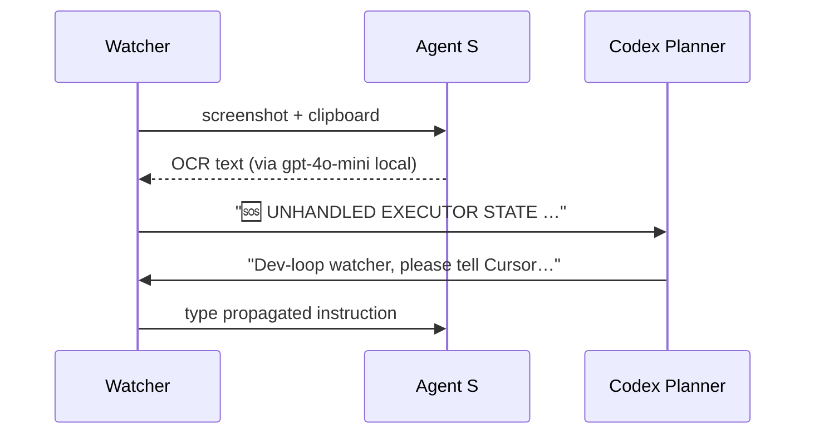

# Oppie Dev-Loop — Low-Level Design  
*(detailed utilities, algorithms & tests)*

---

## 1 Implementation-Requirements

| Concern | Detail |
|:--|:--|
| **Concurrency** | Single watcher process; non-blocking read on Executor pipe; Agent S calls are synchronous (they block < 50 ms). |
| **Synchronisation** | No shared state beyond an `AtomicBoolean recovering`; regex detection and GUI typing never overlap. |
| **Fault-tolerance** | • 3-strike back-off if recovery fires in < 2 s intervals.<br>• Escalation path → ask Codex for manual advice (see § 3.4). |
| **Observability** | JSONL logs: `timestamp`, `event`, `detail`, `cursor_pid`. |

---

## 2 Utilities & Helpers

### 2.1 Watcher main loop (Python pseudocode)

```python
import re, subprocess, json, time
from agent_s_helpers import focus_cursor, type_and_enter

ERROR_RE  = re.compile(r"Exceeded 25 native tool calls")
TEMPLATE_RE = re.compile(r"### 🔄  Template A")

def tail_executor(cmd):
    with subprocess.Popen(cmd,
                          stdout=subprocess.PIPE,
                          stderr=subprocess.STDOUT,
                          text=True) as proc:
        for line in proc.stdout:
            handle_line(line, proc.pid)

def handle_line(line, pid):
    log("EXEC_LOG", line.rstrip(), pid)
    if ERROR_RE.search(line):
        recover("TOOL_LIMIT", pid)
    elif line.startswith("🪄 assistant_bubble_end"):
        if not TEMPLATE_RE.search(line):
            recover("MISSING_TEMPLATE", pid)

def recover(reason, pid):
    log("RECOVER_START", reason, pid)
    focus_cursor()
    type_and_enter(RECOVERY_PROMPT)
    log("RECOVER_DONE", reason, pid)
```

### 2.2 `agent_s_helpers.py`

```python
import agent_s   # official SDK

def focus_cursor():
    win = agent_s.find_window(title_regex=r"Cursor")
    win.focus()

def type_and_enter(text):
    agent_s.type_text(text, delay=0.01)
    agent_s.key_press("enter")
```

*(Agent S exposes high-level window search & typing APIs; no pixel coords needed.)*

---

## 3 Implementation Deep Dive

### 3.1 Regex detection

*Pre-compiled* regexes run on every line; with ~1 k lines / min the CPU cost is negligible (< 0.1 % core).

### 3.2 Agent S vs pyautogui

| Aspect | Agent S | pyautogui (legacy) |
|:--|:--|:--|
| Window targeting | Native window handles | Screen-coord guesses |
| Speed | ~10× faster event dispatch | OK but slower |
| Cross-platform | macOS / Win / X11 | same |
| Dependencies | Signed binary (~5 MB) | pure-python |
| Security prompts | None (uses Accessibility API once) | macOS asks every launch |

### 3.3 Escalation flow



### 3.4 Back-off algorithm

```text
if recoveries_in_last_60s > 3:
    sleep(min(2 ** n, 60))  # exponential, max 60 s
    n += 1
else:
    n = 0
```

---

## 4 Testing & QA

| Level | Tool | What we assert |
|:--|:--|:--|
| **Unit** | `pytest` | Regex matches; Agent S stubs called once |
| **Integration** | `pexpect` | Spawn fake-executor script → watcher recovers |
| **End-to-end** | manual | Real Cursor session; verify loop runs 1 h unattended |

---

## 5 Packaging & Distribution

| Step | Command |
|:--|:--|
| Install deps | `uv pip install -r watcher/requirements.txt` |
| Build single bin | `pyinstaller watcher.spec` |
| Launch whole loop | `scripts/start_devloop.sh` |

`start_devloop.sh` launches **Codex Planner** in a new terminal tab and the Watcher in the current one.

---

## 6 Security Notes

* Agent S uses native Accessibility APIs; first launch asks for consent → documented in README.  
* The watcher never stores keystrokes; only writes timestamped events.  
* No network traffic other than optional Prometheus push-gateway.  

---

## 7 Performance Tuning

*Profile shows 94 % idle time; no hot-spots.  Future: switch to `asyncio` only if we add WebSocket streaming.*