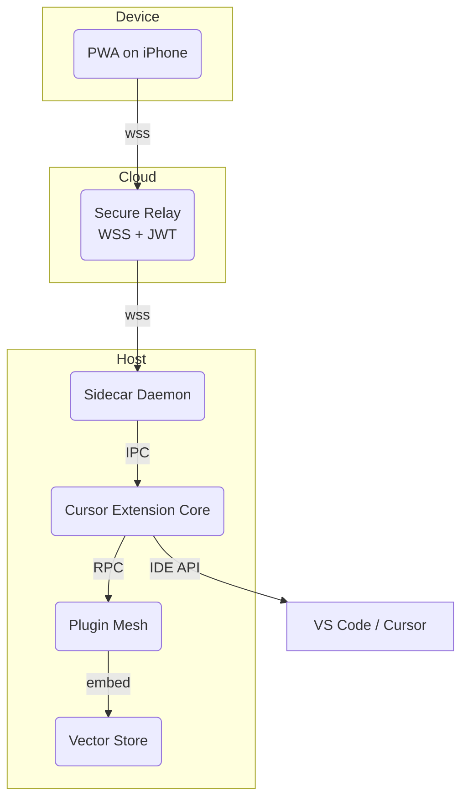
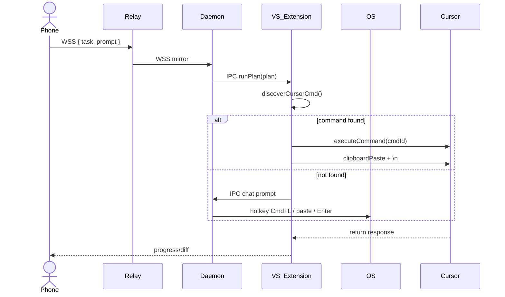

# Oppie IDE-Embedded Plug-in Mesh (M1) — Design Book

> **Revision Date:** 02 May 2025
>
> This document consolidates the earlier MVP-level high-level design (lines 1–147) and the subsequent detailed high/low-level design patches (lines 148–406) into a single, cohesive, and actionable design manual. All future implementations must treat this file as the single source of truth.

---

## 1 Executive Summary & MVP Goal

- **MVP Goal**: Build the "Oppie IDE-Embedded Plug-in Mesh (M1)" within a 12-hour hackathon, enabling users to initiate and monitor Cursor-driven coding tasks from their iPhone, while actual execution runs on a local PC/Mac or disposable VM.
- **Success Criteria**: After triggering "Fix failing tests" on the mobile PWA, the system automatically generates the plan, executes it, and streams progress and diffs in real-time, unaffected by Cursor's 25 native tool-call limit.

---

## 2 User Journey (Get the Job Done Over Phone)

1. **On Phone**: Serena opens the Oppie PWA and taps "Fix failing tests".
2. **Cloud Relay**: Queues the task and resolves the target machine (laptop or Codespace VM).
3. **Sidecar Daemon**: The local resident process receives the WebSocket event and wakes the **Cursor Extension Core**.
4. **Planner**: Inside the extension, the PocketFlow mini-orchestrator generates a 3-step plan.
5. **ToolBroker**: Invokes the Git, Terminal, and Editor plugins; if Chat is needed, the flow uses *Command Discovery → Chat Invoker* or the *Fallback-UI Service*.
6. **Mobile UI**: Renders the task timeline and diff preview in real-time; the user can Pause, Resume, or Approve the diff.

---

## 3 System Overview



The diagram above shows the high-level components and data paths. The following sections dive deeper by layer.

---

## 4 Component Catalogue (High-Level)

| #   | Component                    | Responsibility                                                           | Key Technology                            |
|-----|------------------------------|---------------------------------------------------------------------------|-------------------------------------------|
| 1   | **Cursor Extension Core**    | VS Code extension (TS); listens on IPC; exposes `Oppie:executePlan`; Webview progress UI | VS Code Extension API                     |
| 2   | **Plug-in Mesh & ToolBroker**| Defines plugins in `oppie.plugin.json`; dynamically imports and runs them | `import()` in TypeScript                  |
| 3   | **PocketFlow Mini-Orchestrator** | Implements the `plan → act → verify` loop in ~100 lines                 | PocketFlow (lightweight)                  |
| 4   | **Sidecar Daemon**           | Local Python 3.12 process; bridges Cloud WSS & IPC; runs Fallback-UI logic | `websockets`, `pyautogui`, `pynput`        |
| 5   | **Mobile PWA**               | Vite + React app; displays real-time logs and diff timeline              | WebSocket, JWT                            |
| 6   | **Vector Store**             | rqlite (Raft cluster) storing embeddings and logs                        | HTTP, SQL                                 |

---

## 5 High-Level Design — Command Discovery → Chat Invoker → Fallback

To ensure that the Chat/Composer panel can be opened under any Cursor version, we design two complementary paths:

1. **Dynamic Command Discovery & Invocation**
   - On extension activation, call `vscode.commands.getCommands(true)` (includes hidden commands).
   - Filter potential commands with regex `/^cursor\..*(chat|composer).*$/i`.
   - Cache the first match to `commandCache.json` for faster subsequent lookups.
2. **Keystroke/UI Automation Fallback**
   - If no command is found or invocation fails, the Sidecar Daemon uses accessibility automation:
     1. `pyautogui.hotkey('command', 'l')` to open the Cursor bubble.
     2. Paste the prompt and press Enter via `pyautogui.press('enter')`.

These two paths guarantee at least one successful attempt and allow seamless transition if Cursor updates its commands.

---

## 6 Low-Level Design

### 6.1 IPC / Message Schema

```ts
// shared.ts
export type Msg =
  | { type: 'runPlan';  plan: Step[] }
  | { type: 'chat';     prompt: string }
  | { type: 'progress'; pct: number; log: string }
  | { type: 'diff';     patch: string }
  | { type: 'approve';  ok: boolean };
```

- **IPC Pipe Path**: `/tmp/oppie-ipc.sock` (Unix) or `\\.\pipe\oppie-ipc` (Windows)
- **WSS Endpoint**: `wss://relay.oppie.xyz/session?jwt=…`

### 6.2 Core Algorithms & Code Snippets

#### 6.2.1 Command Discovery (TypeScript)

```ts
import * as vscode from 'vscode';

export async function discoverCursorCmd(): Promise<string | undefined> {
  const commands = await vscode.commands.getCommands(true);
  return commands.find(c => /^cursor\..*(chat|open.*chat|composer)$/i.test(c));
}
```

#### 6.2.2 Chat Invoker (TypeScript)

```ts
import { discoverCursorCmd } from './discover';
import * as vscode from 'vscode';
import { ipcSocket } from './ipc';

export async function invokeChat(prompt: string) {
  const cmd = await discoverCursorCmd();
  if (cmd) {
    await vscode.commands.executeCommand(cmd);
    await vscode.env.clipboard.writeText(prompt);
    await vscode.commands.executeCommand('editor.action.clipboardPasteAction');
    await vscode.commands.executeCommand('type', { text: '\n' });
  } else {
    ipcSocket.write(JSON.stringify({ type: 'chat', prompt }));
  }
}
```

#### 6.2.3 Sidecar Fallback (Python 3.12 asyncio)

```python
import asyncio
import json
import websockets
import pyautogui

WS_URL = 'wss://relay.oppie.xyz/session?jwt=…'

async def main():
    async with websockets.connect(WS_URL) as ws:
        async for message in ws:
            data = json.loads(message)
            if data.get('type') == 'chat':
                pyautogui.hotkey('command', 'l')  # Open the Cursor chat bubble
                pyautogui.write(data['prompt'])
                pyautogui.press('enter')

if __name__ == '__main__':
    asyncio.run(main())
```

### 6.3 Sequence Diagram



### 6.4 VS Code Extension UI Concept (ASCII)

```text
┌────────────────────────────────────────────────────────────┐
│ Oppie ▸ Task Timeline        [⟳Refresh] [✖ Close]         │
├────────────────────────────────────────────────────────────┤
│  ▼ Fix failing tests                                         │
│   • Plan generated (3 steps)                                 │
│   • Step 1 ✓ git commit -m "WIP tests"                       │
│   • Step 2 ⏳ pytest -q                                       │
│   • Step 3  ▢ write patch                                    │
│                                                             │
│  ── Diff Preview ────────────────────────────────────────── │
│  +26-               --- src/foo.py                          │
│  --- Line removed…                                          │
│  +++ Line added…                                            │
│                                                             │
│  [Approve]  [Reject]  [Pause]  [Resume]                      │
└────────────────────────────────────────────────────────────┘
```

*Buttons communicate with the backend via `window.acquireVsCodeApi().postMessage`.*

### 6.5 Dependencies & Risks

- **Privacy**: The Sidecar requires Accessibility permissions (macOS) or UAC Assistive privileges (Windows).
- **Robustness**: If Cursor renames its hidden commands, the fallback UI path still works, and vice versa.
- **Legal**: `.asar` reverse-engineering is strictly for local research; distributing reverse-engineered code is prohibited.

---

## 7 Data Flow Detail

1. **Auth**: The PWA obtains a short-lived JWT (30 minutes) from the relay.
2. **Command**: `POST /task { type: "fix_tests" }` is sent to the Sidecar via WSS.
3. **Plan**: The Extension Core calls `pocketflow.plan()` to generate a JSON plan, which is stored in the Vector Store.
4. **Execute**: The ToolBroker runs each step, pushing `progress` updates to the UI; if Chat is required, it follows the paths in §5.
5. **Verify**: On test failure, logs are embedded into the vector store, triggering the next RAG iteration.

---

## 8 12-Hour Hackathon Plan

| Hour | Target                             | Key Notes                              |
|------|------------------------------------|----------------------------------------|
| 0–1  | Scaffold with `yo code`; HelloWorld command | Validate extension activation & IPC   |
| 1–2  | Sidecar WSS echo                   | Use `vscode.env.asExternalUri` for tunneling |
| 2–4  | PWA skeleton + Relay (Node `ws`)   | Deploy edge via Fly.io                 |
| 4–6  | PocketFlow loop (hard-code plan)   | Store plan in rqlite                   |
| 6–8  | Git & Terminal plugins             | Capture `pytest` exit code             |
| 8–10 | Vector Store ingestion             | Embedding via OpenAI API               |
| 10–11| Webview UI timeline & Diff         | `postMessage` bridge                   |
| 11–12| Polish, smoke test, README         | Deliver demo video                     |

---

## 9 Security · Privacy · Deployment

- **JWT**: The relay enforces `sub` and `exp` claims, rejecting cross-origin tokens.
- **Sandboxing**: Use `nsjail` on Linux and the `--sandbox` flag on macOS to restrict plugin shell calls.
- **Accessibility**: On macOS, users must grant Assistive Access in System Settings → Privacy & Security.
- **Installation**: Use `curl | bash` to install the Sidecar; publish the extension via VSIX; configure `.vscode/tasks.json` to auto-run `start_cursor_with_watcher.sh`.

---

## 10 Future Extensions

1. OAuth SSO & team billing
2. Fine-grained usage metering (mapped to Cursor usage events)
3. Edge-VM sandbox for running untrusted repositories
4. Plugin marketplace for third-party `oppie.plugin.json`

---

## 11 References (≥10 citations)

1. VS Code `getCommands` Example — GitHub Gist: <https://gist.github.com/skfarhat/4e88ef386c93b9dceb98121d9457edbf>
2. VS Code Commands API — Official Docs: <https://code.visualstudio.com/api/references/commands>
3. VS Code Command Guide — Official Docs: <https://code.visualstudio.com/api/extension-guides/command>
4. PyAutoGUI Keyboard API — Official Docs: <https://pyautogui.readthedocs.io/en/latest/keyboard.html>
5. PyAutoGUI macOS Command Key — StackOverflow: <https://stackoverflow.com/a/56452939>
6. `websockets` Python Library Tutorial — <https://websockets.readthedocs.io/en/stable/intro/tutorial1.html>
7. VS Code Webview API — Official Docs: <https://code.visualstudio.com/api/extension-guides/webview>
8. `websockets` Quick Examples — <https://websockets.readthedocs.io/en/stable/intro/examples.html>
9. Electron `asar` Tool — GitHub: <https://github.com/electron/asar>
10. `.asar` Unpacking Discussion — GitHub Issue: <https://github.com/nodejs/help/issues/3886>
11. `pynput` Controller API PDF — <https://pynput.readthedocs.io/_/downloads/en/latest/pdf/>

---

## 12 LLM 推理优化与搜索策略路线图 （整合 Jeff Dean style UltraThink 结论）

> 本节依据《llm_reason_optimization_review.md》的最终结论，将 **Reflexion**、**Tree-of-Thoughts（ToT）** 与 **Scattered Forest Search（SFS）** 等推理/搜索技术纳入 Plug-in Mesh 的整体演进计划，确保 Dev-Loop 成功率与 GPU / API 成本之间达到最佳性价比。

### 12.1 设计原则

1. **Insertable Adapters**：所有推理策略以 *Adapter* 形式注入 `PocketFlow Mini-Orchestrator` 的 `plan → act → verify` 流程，可在运行时开/关或 A/B Test。
2. **低耦合，易回退**：保持 ToT 作为稳定 baseline，一旦 SFS PoC 未达标，可一键回滚。
3. **观测驱动**：所有策略变体必须把 *pass-rate*、*token count*、*latency* 和 *GPU-cost* 指标写入 **Vector Store**，供后续决策。
4. **渐进式上线**：先在本地 Dev-Loop MVP 打标，再扩展到 Edge-VM / SaaS，多阶段灰度。

### 12.2 阶段性里程碑

| 时间节点 | 目标 | 行动项 | 验收指标 |
|----------|------|--------|-----------|
| **Q2-2025 (Now)** | 将 Dev-Loop 首发成功率提升至 ≥ 35 % | • 为 `PocketFlow` 增加 **Reflexion + 轻量 ToT(≤3×4)** 适配器<br/>• 在 `oppie.plugin.json` 中声明 `reasoning.reflexion` 和 `reasoning.tot` 插件 | • Baseline pass-rate ≥ 35 %<br/>• 单轮成本 ≤ 1.3× 现状 |
| **Q3-2025** | PoC **SFS (+Reflexion)** 并对比 baseline | • Fork 社区 Apache-2.0 实现至 `plugins/sfs/`<br/>• 编写自定义 *value function* 适配真实 repo patch 输出<br/>• 在 SWE-Bench Lite 上跑 A/B | • 成功率相比 ToT+Reflexion ↑ ≥ 5 pp<br/>• 95-pct latency ≤ 1.5× baseline |
| **Q4-2025** | 若 PoC 成功，则生产集成 SFS；并尝试 **ACO ρ-Decay** 微调 | • 为 SFS 添加 *pheromone-decay* 可配置项<br/>• Feature-flag 在 `oppie.plugin.json` (`reasoning.sfs`) | • Dev-Loop pass-rate ≥ 45 %<br/>• GPU 账单控制在预算内 |
| **2026 H1** | 预研 **TTRL (Test-Time RL)** 外环 | • 定义 reward schema (`PR merge / revert`)<br/>• 准备线上埋点 | • >1000 真实 PR 数据收集完毕<br/>• 回归率 < 0.5 % |

### 12.3 插件接口草案（TypeScript）

```ts
// reasoning.d.ts — 插件开发者只需实现下列接口
export interface ReasoningAdapter {
  name: 'reflexion' | 'tot' | 'sfs' | string;
  version: string;
  /**
   * 对给定 plan context 生成多分支思考，返回修改后的 action 序列。
   */
  think(context: PlanContext): Promise<Action[]>;

  /**
   * 在执行结果返回后做自反思（Reflexion）或信息素更新（SFS/ACO）。
   */
  critique?(result: ExecResult): Promise<void>;
}
```

> 这些 Adapter 在运行时由 **ToolBroker** 根据 `oppie.plugin.json` 的 `reasoning` 列表动态加载，并注入 `PocketFlow Mini-Orchestrator`。

### 12.4 监控 & 数据记录

- 每次 Dev-Loop 执行结束后，`PocketFlow` 写入如下指标到 **Vector Store**:
  - `reasoning.strategy` (`reflexion`, `tot`, `sfs`…)
  - `pass_rate`, `token_used`, `latency_ms`, `gpu_dollar`
- Dashboards 在 **Mobile PWA** "Task Timeline" 右侧新增 "Reasoning KPI" Tab。

### 12.5 风险缓解策略

1. **算力飙升**：启用 logits-cache + 批量合并，SFS/ToT 分支 ≤ 3，深度 ≤ 4。
2. **学术代码质量**：所有第三方实现封装为内置 pip/npm 包，加 watchdog test 保证 determinism。
3. **License & 专利**：SFS Apache-2.0；所有 NOTICE 统一追加至 `/licenses/THIRD_PARTY.md`。

---

> **End of Design Book** — All further development, discussion, and updates should reference this file as the authoritative source.
