# Oppie.xyz — Plan-Execu Tight Loop & Self-Recovery MVP Tech Stack Document

This document details the chosen technologies and design rationale for implementing the **Planner ⇄ Executor Tight Loop with automatic self-recovery** as specified in the PRD (`.cursor/prd.md`).  The structure and format mirror the example in `cloud_kitchen_tech_stack.md` for consistency.

---
## 1. System Architecture Overview – Self-Recovery Loop

```mermaid
graph TD
    subgraph "Cursor IDE (Single Workstation)"
        Planner["Codex Planner (o3 model)"]
        Executor["Cursor Executor"]
        WatcherTyper["Watcher & Typer Script"]
    end

    Planner -- "Generate Plan  ⤵" --> Executor
    Executor -- "Tool Calls / Output" --> WatcherTyper
    WatcherTyper -- "Recovery Prompt (GUI)" --> Executor
    Executor -- "Continues Execution" --> Planner
```



**Key Points**
1.  The **Watcher & Typer Script** runs *outside* Cursor, monitoring the Executor's stdout/stderr.
2.  Upon detecting the fatal limit error (`Exceeded 25 native tool calls`), it uses **GUI automation** to paste a fixed recovery prompt, seamlessly continuing the loop without human intervention.

---
## 2. Core Data Flows – MVP

### 2.1 Error Detection & Recovery Flow


---
## 3. Core Technology Choices

### 3.1 Programming Language: **Python 3.x**

| Pros | Cons |
|------|------|
| Widely available on macOS/Linux/Windows | Requires separate runtime installation on some machines |
| Rich standard libraries for subprocess I/O & regex | Potential version drift between 3.8 ↔ 3.12 |
| Excellent ecosystem for GUI automation (pyautogui, pywin32) | Slight overhead compared to compiled binaries |
| Rapid scripting & small footprint | None critical for this MVP |

**Decision Reasoning**  
The MVP demands a light, standalone script with minimal dependencies. Python balances ease-of-use, cross-platform support, and quick development time.

**Alternatives Considered**
1. **Go** – single static binary, but GUI automation libraries are immature.  
2. **Node.js** – added runtime, heavier memory footprint.

---
### 3.2 GUI Automation Library: **pyautogui**

| Pros | Cons |
|------|------|
| Pure-Python, no platform-specific build required | Relies on screen coordinates – fragile to UI changes |
| Cross-platform (macOS, Windows, Linux) | Limited window-focusing primitives (may require extra libs) |
| Simple API (`typewrite`, `press`) | Security prompts on macOS (Accessibility permissions) |

**Decision Reasoning**  
`pyautogui` offers the simplest path to simulate keystrokes and quickly focus the Cursor input field. For the MVP, robustness against large UI changes is not critical.

**Alternatives Considered**
1. **AppleScript / Automator** (macOS-only) – not cross-platform.  
2. **SikuliX** – heavyweight (Java + OpenCV) for image recognition.

---
### 3.3 Error Stream Monitoring: **`subprocess` + Regex**

*Implementation Sketch*
```python
import re, subprocess, logging

ERROR_RE = re.compile(r"Exceeded 25 native tool calls")

with subprocess.Popen(
        ["cursor", "run"],  # pseudocode – actual command launching Executor
        stdout=subprocess.PIPE,
        stderr=subprocess.STDOUT,
        text=True,
) as proc:
    for line in proc.stdout:
        logging.info(line.rstrip())
        if ERROR_RE.search(line):
            trigger_recovery()
```

| Pros | Cons |
|------|------|
| Zero external deps (stdlib only) | Needs robust process spawning for various user setups |
| Regex is fast & deterministic | Requires user to wrap Executor invocation via this script |
| Easy to unit-test with mocked streams | - |

---
### 3.4 Concurrency Model: **Single-Thread + Non-Blocking Read**

*Rationale*: Stdout stream handling and GUI typing are lightweight; a single thread using `select`/`poll` or `iter(pipe)` suffices.  No heavy concurrency primitives are needed.

*Future-Proofing*: If we later introduce WebSocket log streaming or multiple Executor processes, we can refactor to `asyncio` or a small thread-pool without design upheaval.

---
### 3.5 Logging: **Python `logging` Module**

*Usage Pattern*
```python
logging.basicConfig(
    level=logging.INFO,
    format="%(asctime)s %(levelname)s: %(message)s",
)
logging.info("RECOVER_TRIGGERED")
```

| Pros | Cons |
|------|------|
| Built-in, thread-safe | None for this scale |
| Supports rotating files via `RotatingFileHandler` | - |

---
### 3.6 Packaging & Distribution

| Tool | Purpose |
|------|---------|
| `pip` / `requirements.txt` | Install `pyautogui` + pinned versions |
| **Virtualenv** (optional) | Isolate dependencies |
| **Homebrew Formula (future)** | One-line install on macOS |

A minimal `requirements.txt`:
```
pyautogui==0.9.54
```

> Mac users must grant *Accessibility* permissions to the terminal (or Python) the first time `pyautogui` attempts keystrokes.

---
## 4. Infrastructure & Deployment

### 4.1 Repository Layout (Key Files & Folders)
```text
oppie.xyz/
├── .cursorrules                    # Core Cursor rules (includes drop-in continuation guard-rails)
├── .vscode/
│   └── tasks.json                  # Auto-runs start_codex.sh on folder open
├── .specstory/                     # SpecStory history & backups
│   ├── history/
│   └── ai_rules_backups/
├── .cursor/
│   ├── tech_stack.md               # <-- this document
│   ├── prd.md                      # Simple PRD for Tight Loop MVP
│   ├── rules/                      # Additional Cursor rule files
│       └── drop-in_template_A.mdc  # Planner ↔ Executor recursive handshake template
├── codex.md                        # Planner-focused guidelines
├── watcher/                        # Self-recovery script package
│   ├── __init__.py
│   ├── watcher.py
│   └── requirements.txt
├── start_codex.sh                  # Zsh launcher for Codex Planner
└── README.md                       # Setup & usage instructions
```

### 4.2 Execution Workflow
1.  **Install deps**: `uv pip install -r watcher/requirements.txt`  
2.  **Launch Cursor Executor via wrapper**:  
    ```bash
    python watcher/watcher.py -- cursor run_executor_command_here
    ```
3.  The wrapper starts the specified command, streams output, triggers recovery when needed, and exits when the child process ends.

### 4.3 Auto-Restart & Template Enforcement
In addition to monitoring for `Exceeded 25 native tool calls`, the **Watcher** must now fulfill two additional responsibilities:

1. **Template Verification Enforcement**  
   - Whenever the Cursor Assistant outputs a *type 2 bubble* (i.e., assistant response), the Watcher should scan the text of that bubble to ensure it ends with the **Template A – Plan-and-Execute Loop** segment as specified in `@drop-in_template_A.mdc` (this can be achieved by searching for `### 🔄  Template A` or another unique anchor point).  
   - If the template ending is not detected within a specified grace period (e.g., 3 seconds), the same GUI recovery process as FR-S2–S4 should be immediately triggered to ensure the Planner receives a new **Prompt Aₙ**.  
   - Relevant log keywords: `TEMPLATE_MISSING` (triggered), `TEMPLATE_ENFORCED` (GUI input completed).

2. **One-Click Startup Script**  
   - Introduce a `start_cursor_with_watcher.sh` script (or an equivalent Makefile target). The script process:  
     ```bash
     #!/usr/bin/env bash
     set -euo pipefail

     # 1. Start Codex Planner (in the background)
     ./start_codex.sh &
     CODex_PID=$!

     # 2. Start Watcher with the Cursor Executor command
     #    Assuming the cursor executor command is "cursor run", replace as needed
     python watcher/watcher.py -- cursor run
     ```
   - Developers can simply execute in the project root directory:
     ```bash
     ./start_cursor_with_watcher.sh
     ```
     to simultaneously start the Codex Planner and the Watcher-wrapped Cursor Executor.
   - The VS Code `tasks.json` can add a **"Start Codex Planner with Watcher"** task to invoke this script, with `runOn` set to `folderOpen`.

> **Additional Dependencies**: The script itself introduces no new dependencies; the existing `watcher/requirements.txt` remains unchanged.

#### 4.3.1 Escalation Flow for Unhandled Situations
If the Watcher detects that Cursor Executor's output doesn't match known error patterns (such as neither the 25-call limit nor template missing), it should enter an **Automatic Escalation** process:

1. **Context Collection**  
   - Capture the **last 20 lines** of text from the *most recent* Cursor Executor Bubble; for graphical error dialogs, take a screenshot and save as a temporary PNG.  
   - Use a locally callable *gpt-4o-mini* OCR/text extraction interface to convert screenshots to plain text.  
   - Construct the following formatted prompt:  
     ```text
     ### 🆘 UNHANDLED EXECUTOR STATE
     ```
     ```text
     LAST_20_LINES:
     <extracted text pasted as base64 or markdown code block>
     ```
     ```text
     INSTRUCTION: Codex Planner, how should we proceed?
     ```

2. **Request Help from Codex Planner**  
   - Copy the above prompt to the Codex Planner input box and press Enter.  
   - Wait for Codex to respond, whose instructions will begin with the key phrase **"Dev-loop watcher, please tell Cursor Executor: ```<CodexPlanner instruction to Cursor Executor>```"**.

3. **Execute Instructions**  
   - Watcher parses the Codex instruction and copies the remaining text completely to the Cursor Executor input box, then presses Enter to continue the development loop.

4. **Logging**  
   - Escalation triggered: `ESCALATION_TRIGGERED`  
   - OCR completed: `ESCALATION_OCR_DONE`  
   - Codex request sent: `ESCALATION_REQUEST_SENT`  
   - Instruction forwarded: `ESCALATION_INSTRUCTION_FORWARDED`

> **Implementation Note**: OCR/text extraction can be done through the `gpt-4o-mini` API, locally wrapped as a `python watcher/ocr_extract.py <img_path>` command, returning a Markdown fragment.

---
## 5. Testing & Validation Strategy

| Level | Focus | Tools |
|-------|-------|-------|
| **Unit** | Regex detection, prompt string correctness | `pytest`, `unittest.mock` |
| **Integration** | Spawn dummy process emitting the error, assert GUI call mocked | `pytest`, `subprocess`, `pytest-monkeypatch` |
| **Manual** | End-to-end run with real Cursor session | Human observation + log review |

### Sample Unit Test (Regex)
```python
from watcher.watcher import ERROR_RE

def test_error_regex():
    assert ERROR_RE.search("[WARN] Exceeded 25 native tool calls (limit)")
```

---
## 6. Security, Privacy & OS Permissions
*   **macOS Accessibility**: Grant Terminal/Python *Accessibility* rights to allow key events.  
*   **Input Sanitisation**: Recovery prompt is a fixed literal string – no user data injection risk.  
*   **Process Isolation**: The watcher never introspects internal Cursor state; it only reads stdout/stderr streams.

---
## 7. Future Evolution
1. **Robust Window Focusing**: Integrate platform-specific APIs (AppleScript, Win32) to guarantee the correct text field target.
2. **Backoff & Retry**: Add exponential backoff in case multiple consecutive recoveries fail.
3. **Metrics Export**: Expose recovery counts via Prometheus client for long-running sessions.
4. **Single Executable**: Bundle with `pyinstaller` for a no-install binary.

---
## 8. Conclusion
This tech-stack leverages **Python + pyautogui** for rapid, cross-platform GUI automation, paired with simple subprocess monitoring to satisfy all PRD functional requirements (FR-S1 – FR-S5) with minimal complexity.  The design leaves ample room for iterative enhancements while delivering immediate value through automated self-recovery of the Planner ⇄ Executor loop. 